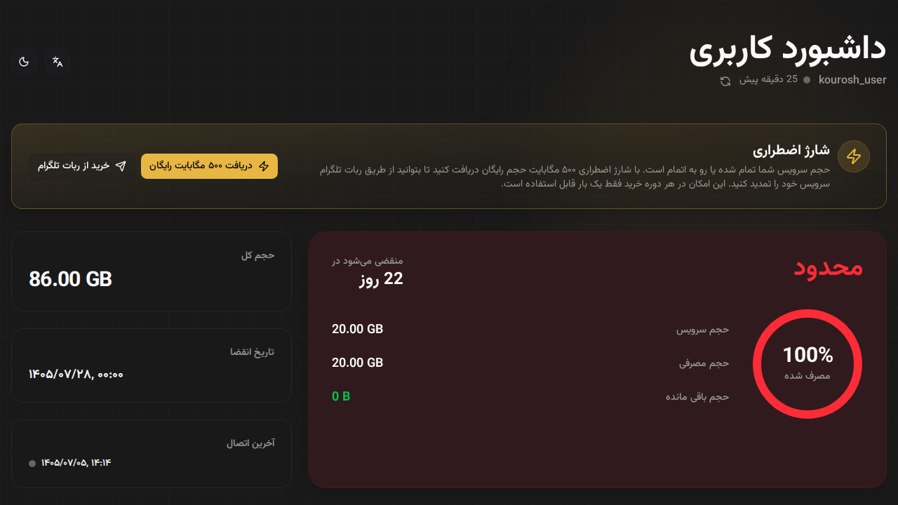
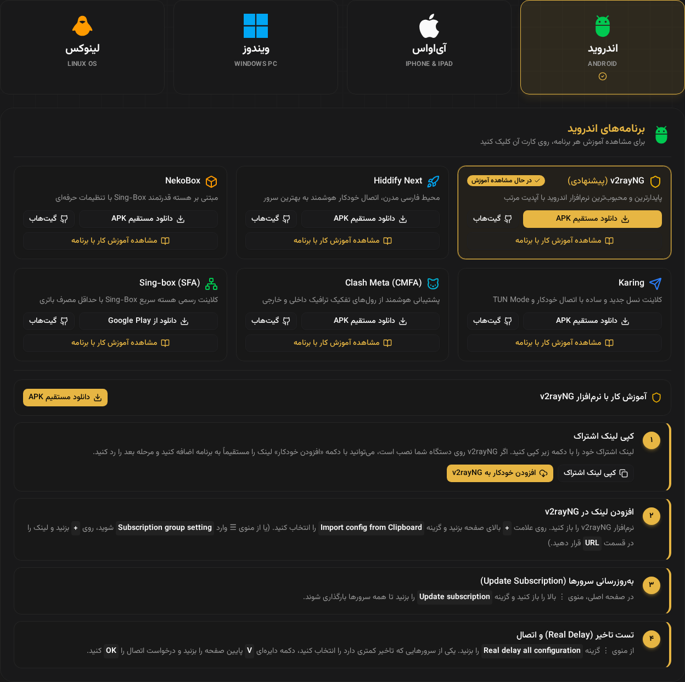
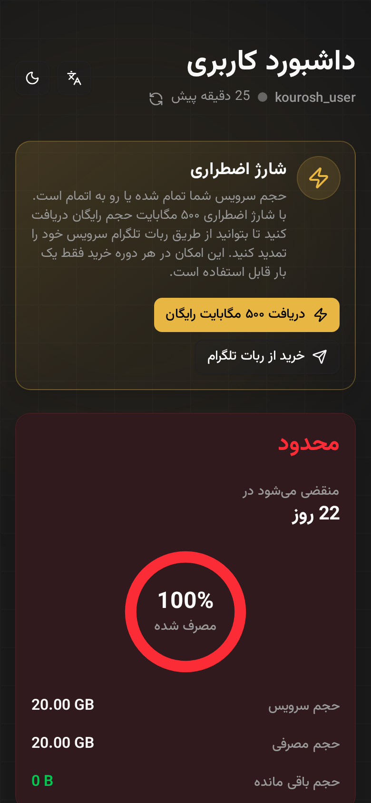

# PasarGuard Subscription Template

Responsive subscription page template for PasarGuard.

<p align="center">
  
  
</p>

## Emergency Charge & Setup Guide Preview

<p align="center">
  
</p>
<p align="center">
  
  
</p>

Interactive demo with sample data: download [`preview/index.html`](preview/index.html) and open it in a browser.

## Features

- Languages: `en`, `fa`, `zh`, `ru`
- User can switch language in UI
- Responsive layout
- Dark mode
- QR code for connection links
- Copy links/configs in one click, with Base64 copy available only in the QR modal
- WireGuard links can be copied as native config or downloaded as `.conf`
- Setup guide section: platform picker, app cards with download/GitHub links and step-by-step tutorials (edit `src/constants/tutorials.ts`)
- [Emergency charge](#emergency-charge): lets a user who ran out of traffic claim free traffic once per period to renew through your Telegram bot
- [Appearance customization](#appearance-customization)

## Compatibility

| Subscription Template | PasarGuard Panel |
| --- | --- |
| `v2` | `v3` |
| Other versions | `v2`, `v1` |

## Quick Start (Recommended)

Run installer script (choose your fallback language):

```sh
curl -fsSL https://raw.githubusercontent.com/PasarGuard/subscription-template/main/install.sh | sudo bash -s -- --lang fa
```

Supported values for `--lang`: `en`, `fa`, `zh`, `ru`
Supported values for `--version`: `latest` (default) or a release tag like `v2.0.0`
To install a specific release, add `--version <tag>`.

## Manual Install

1. Download template:

```sh
sudo mkdir -p /var/lib/pasarguard/templates/subscription
sudo wget -O /var/lib/pasarguard/templates/subscription/index.html \
https://github.com/PasarGuard/subscription-template/releases/latest/download/index.html
```

2. Configure PasarGuard in `/opt/pasarguard/.env`:

```dotenv
CUSTOM_TEMPLATES_DIRECTORY="/var/lib/pasarguard/templates/"
SUBSCRIPTION_PAGE_TEMPLATE="subscription/index.html"
```

3. Restart:

```sh
pasarguard restart
```

## Build From Source

```sh
git clone https://github.com/PasarGuard/subscription-template.git
cd subscription-template
bun install
bun run build
```

Use the built file:

```sh
sudo cp dist/index.html /var/lib/pasarguard/templates/subscription/index.html
```

<a id="appearance-customization"></a>

## Appearance Customization

Set these in `.env` and build again:

```dotenv
VITE_PRIMARY_COLOR_LIGHT=oklch(0.48 0.11 250)
VITE_PRIMARY_COLOR_DARK=oklch(0.60 0.12 250)
VITE_BORDER_RADIUS=0.65rem
```

<a id="emergency-charge"></a>

## Emergency Charge

When a user is out of (or low on) traffic, the page shows an emergency charge card. It needs a small service running next to the panel; see [emergency-charge/README.md](emergency-charge/README.md). Then set these in `.env` and build again:

```dotenv
VITE_EMERGENCY_CHARGE_URL=https://panel.example.com:8765/emergency-charge
VITE_EMERGENCY_CHARGE_MB=500
VITE_EMERGENCY_CHARGE_THRESHOLD_MB=500
VITE_TELEGRAM_BOT_URL=https://t.me/your_bot
```

## Other Languages

- [فارسی (Persian)](README.fa.md)
- [Русский (Russian)](README.ru.md)
- [中文 (Chinese)](README.zh.md)
